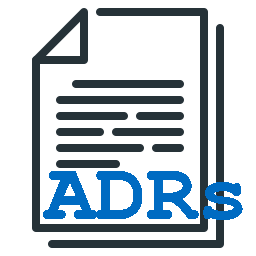

<meta name="google-site-verification" content="P-ChZejwkshKxAHqN1f7JrPL4o-a5btgXdg7FM0jieo" />

# adr-go

Simple tool for handling ADRs (Architecture Decision Records), inspired by existing tools, in particular the [original adr-tools](https://github.com/npryce/adr-tools) as general source, the [node.js implementation by _phodal_ and others](https://github.com/phodal/adr) in particular regarding file and folder structures, and [_marouni_'s Go implementation](https://github.com/marouni/adr).

## Raison d'être

The reason for yet another implementation was basically that at work the phodal tooling was introduced to manage ADRs for our projects, but in general I was not happy with the performance and the user experience I had with it. A Go implementation, which results in a single executable (thereby allowing a simple copy-install instead of something more complex) appealed to me, but my primary requirement was compatibility with the folder and file structures introduced and used by the _adr-tools_.

After trying out [_marouni_'s Go implementation](https://github.com/marouni/adr), I decided that it would be easier to start from scratch to recreate the _phodal_ tool, instead to contributing to or forking _marounis_ work. Of course, this does not mean any critique on any of those other tools, but just that for my use case and my user preferences, this 

## Developer information

### Build release version

Based on [this stackoverflow article](https://stackoverflow.com/questions/29599209/how-to-build-a-release-version-binary-in-go), use this command line to strip debug and symbol information during build:

    go build -ldflags "-s -w"

